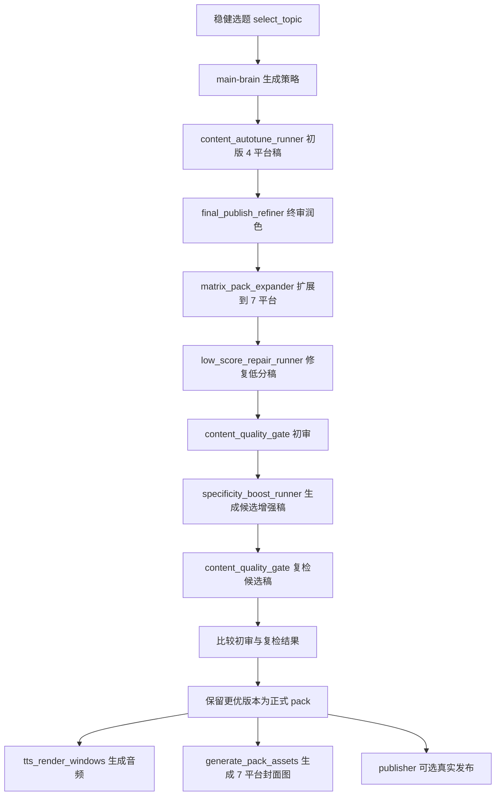
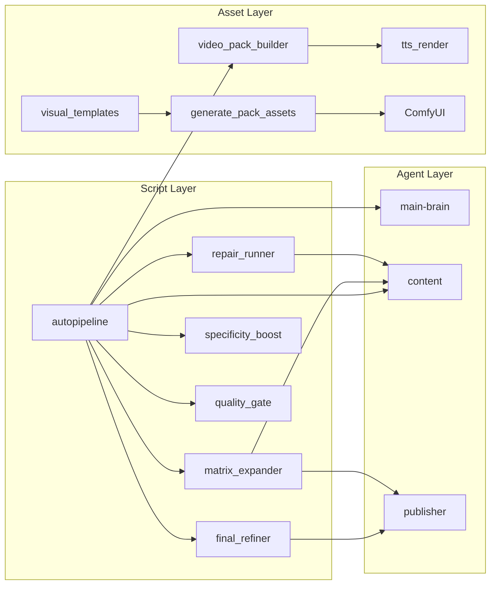

# OpenClaw 内容工厂系统架构完整报告

## 1. 执行摘要

当前系统已经可以稳定完成“选题 -> 多平台内容生产 -> 终审 -> 低分修复 -> 质量复检 -> TTS -> 封面图生成”这条生产链。

结论：

1. 可以上线为“生产级内容生成与素材生产系统”
2. 还不建议上线为“完全无人值守真实发布系统”
3. 最合理的上线方式是：
   - 系统自动出内容包
   - 人工抽检
   - 再决定真实发布

当前最新稳定基线：

- 报告：`C:\Users\Roy\.openclaw\workspace\reports\pipeline_autorun_20260308_205355.json`
- 复检：`C:\Users\Roy\.openclaw\workspace-content\quality_20260308_205355_recheck.json`
- 素材：`C:\Users\Roy\.openclaw\workspace-content\asset_manifest_daily_20260308_205355.json`

最新复检分数：

- 知乎 `100`
- 小红书 `98`
- 抖音 `98`
- B站 `92`
- 微博 `92`
- 公众号 `96`
- 头条 `98`

## 2. 系统目标

系统的实际目标不是“写文案”，而是“产出带变现路径的发布包”。

一个完整发布包应包含：

1. 7 平台 draft
2. 终审结果
3. 平台变现计划
4. 平台 readiness
5. 附件页/清单
6. 视频分镜与 TTS 脚本
7. 视觉模板
8. 平台封面图

## 3. 当前核心组件

### 3.1 编排层

- [autopipeline_brain_content_publisher.py](C:\Users\Roy\Documents\New%20project\autopipeline_brain_content_publisher.py)

职责：

- 选题
- 主脑策略
- 启动各阶段脚本
- 记录报告
- 控制是否跳过发布

### 3.2 内容生产层

- [content_autotune_runner.py](C:\Users\Roy\Documents\New%20project\content_autotune_runner.py)
- [final_publish_refiner.py](C:\Users\Roy\Documents\New%20project\final_publish_refiner.py)

职责：

- 生成初版 4 平台稿件
- 按评分重写
- 终审润色
- 生成 publisher review

### 3.3 平台扩展层

- [matrix_pack_expander.py](C:\Users\Roy\Documents\New%20project\matrix_pack_expander.py)
- [platform_monetization_mapper.py](C:\Users\Roy\Documents\New%20project\platform_monetization_mapper.py)

职责：

- 把 4 平台扩成 7 平台
- 挂载变现矩阵
- 挂载 platform readiness

### 3.4 质量与修复层

- [content_quality_gate.py](C:\Users\Roy\Documents\New%20project\content_quality_gate.py)
- [low_score_repair_runner.py](C:\Users\Roy\Documents\New%20project\low_score_repair_runner.py)
- [specificity_boost_runner.py](C:\Users\Roy\Documents\New%20project\specificity_boost_runner.py)

职责：

- 打分
- 识别平台不合格点
- 修复长文平台低分稿
- 对 `知乎/小红书` 补具体性
- 做复检

### 3.5 视频与附件层

- [publish_appendix_builder.py](C:\Users\Roy\Documents\New%20project\publish_appendix_builder.py)
- [video_publish_pack_builder.py](C:\Users\Roy\Documents\New%20project\video_publish_pack_builder.py)
- [tts_render_windows.py](C:\Users\Roy\Documents\New%20project\tts_render_windows.py)

职责：

- 补附件页
- 生成 Douyin/B站 视频包
- 生成 TTS 音频

### 3.6 视觉资产层

- [platform_visual_templates.py](C:\Users\Roy\Documents\New%20project\platform_visual_templates.py)
- [generate_pack_assets.py](C:\Users\Roy\Documents\New%20project\generate_pack_assets.py)
- [start_comfy_directml.py](C:\Users\Roy\Documents\New%20project\start_comfy_directml.py)

职责：

- 平台视觉模板
- ComfyUI 封面图生成
- DirectML 启动

### 3.7 运行时与运维层

- [adspower_runtime.py](C:\Users\Roy\Documents\New%20project\adspower_runtime.py)
- [release_browser_memory.py](C:\Users\Roy\Documents\New%20project\release_browser_memory.py)
- [remote_openclaw_validation.py](C:\Users\Roy\Documents\New%20project\remote_openclaw_validation.py)
- [full_agent_healthcheck.py](C:\Users\Roy\Documents\New%20project\full_agent_healthcheck.py)

职责：

- AdsPower 运行时接入
- 释放浏览器资源
- 远端验证
- agent 可用性检查

## 4. Agent 职责划分

已验证可用的 7 个 agent：

1. `main`
2. `main-brain`
3. `content`
4. `multimodal`
5. `publisher`
6. `monitor`
7. `tasks`

当前生产链里实际高频使用的是：

1. `main-brain`
2. `content`
3. `publisher`

说明：

- `publisher` 在当前安全链路里主要承担“审核/预发布视角”，不做真实外发。
- `multimodal` 已验证可用，但当前视觉生产主要由脚本 + ComfyUI 完成。

## 5. 当前合作流程

### 5.1 逻辑流程

### 5.2 组件协作图

## 6. 当前链路产物结构

最新 pack 包含这些关键字段：

1. `drafts`
2. `scores`
3. `publisher_review`
4. `appendices`
5. `monetization_plans`
6. `global_monetization_matrix`
7. `platform_readiness`
8. `video_publish_kits`
9. `assets`
10. `visual_templates`
11. `repair_log`
12. `specificity_boost_log`

这说明系统已经从“单稿生成器”进化成“完整发布包生成器”。

## 7. 当前验证结果

### 7.1 主链验证

最新安全回归报告：

- `C:\Users\Roy\.openclaw\workspace\reports\pipeline_autorun_20260308_205355.json`

关键状态：

- `main_brain = ok`
- `autotune = ok`
- `final_refine = ok`
- `matrix_expand = ok`
- `repair = ok`
- `quality_gate = ok`
- `specificity_boost = ok`
- `quality_recheck = ok`
- `tts_render = ok`
- `asset_render = ok`
- `publisher = skipped`

### 7.2 复检结果

复检报告：

- `C:\Users\Roy\.openclaw\workspace-content\quality_20260308_205355_recheck.json`

结果：

- `pass_count = 7`
- `pass_rate = 1.0`
- `avg_score = 96.29`

### 7.3 视觉素材结果

素材清单：

- `C:\Users\Roy\.openclaw\workspace-content\asset_manifest_daily_20260308_205355.json`

7 平台素材均已生成，体积大致如下：

- 知乎 `0.84 MB`
- 小红书 `0.93 MB`
- 抖音 `1.52 MB`
- B站 `1.50 MB`
- 微博 `1.56 MB`
- 公众号 `0.38 MB`
- 头条 `0.88 MB`

### 7.4 视频音频结果

- `C:\Users\Roy\.openclaw\workspace-content\tts_20260308_205355\bilibili_tts.wav`
- `C:\Users\Roy\.openclaw\workspace-content\tts_20260308_205355\douyin_tts.wav`

## 8. 是否可以上线生产使用

结论分两层：

### 8.1 可以上线的部分

可以上线为：

- 内容生产系统
- 审稿与复检系统
- 视频脚本与 TTS 生产系统
- 封面图生产系统

也就是说，以下场景已经具备生产价值：

1. 批量生成候选稿
2. 批量生成变现导向内容包
3. 批量生成 7 平台素材
4. 作为运营团队日更工厂

### 8.2 还不建议直接上线的部分

不建议直接无人值守上线：

- 真实平台外发
- 完全自动发布闭环
- 自动根据平台交互直接做大动作改版

原因：

1. 最新主链仍是 `skip_publisher` 验证为主
2. `publisher` 以前有过 JSON 稳定性问题，虽然审核链已接通，但真实外发未做新的生产回归
3. 平台规则和审核波动仍需要人工判断

### 8.3 当前推荐上线方式

推荐用“半自动生产”模式上线：

1. 系统自动生成内容包
2. 人工抽检高风险平台稿件
3. 人工确认再发布
4. 记录真实平台数据回灌系统

## 9. 当前系统的强项与短板

### 9.1 强项

1. 7 平台内容结构已经打通
2. 长文平台修复能力明显增强
3. 可直接输出图文+视频双线素材
4. 变现路径已经不是口号，而是挂进了内容包
5. 24G 内存机器上也能稳定跑通

### 9.2 短板

1. 真正的真实发布链路没有做新的生产回归
2. `知乎/小红书/微博/抖音` 仍偶尔会残留 `low_specificity_numbers`
3. 抖音脚本有时还会出现 `douyin_rhythm_weak`
4. 现在的系统仍然是“高质量内容工厂”，不是“自动经营系统”

## 10. 后续如何根据平台数据优化

建议把优化闭环拆成 4 层。

### 10.1 采集层

每条内容至少记录：

1. 平台
2. 发布时间
3. 题材
4. 标题
5. hook 类型
6. CTA 类型
7. 素材版本
8. 24h/48h 数据

推荐平台指标：

- 知乎：收藏率、评论关键词率、商品卡点击率
- 小红书：收藏率、主页点击率、私信关键词率
- 抖音：3 秒完播率、主页点击率、橱窗点击率
- B站：平均观看时长、三连率、评论关键词率
- 微博：转评赞比、链接点击率
- 公众号：打开率、读完率、资料领取率
- 头条：阅读时长、读完率、收藏率

### 10.2 诊断层

每周做一次内容复盘，把问题拆成：

1. 题材问题
2. 标题问题
3. hook 问题
4. CTA 问题
5. 封面问题
6. 平台适配问题

### 10.3 优化层

优先优化顺序建议：

1. 标题与 hook
2. CTA
3. 封面图
4. 正文结构
5. 附件页与资料包

原因：

- 这是最直接影响点击和转化的层
- 也是最容易量化 A/B 的层

### 10.4 回灌层

建议后续新增一个数据回灌模块，把平台结果直接写回：

1. `platform_monetization_mapper.py`
2. `specificity_boost_runner.py`
3. `low_score_repair_runner.py`
4. 选题白名单

这样系统会逐渐从“规则驱动”变成“规则 + 数据驱动”。

## 11. 后续开发优先级

### P1

1. 给真实发布链路做新的生产回归
2. 把 `quality_recheck` 的结果正式写为最终 pack 元数据
3. 新增平台数据回灌存储

### P2

1. 给抖音补节奏优化器
2. 给微博补快反模板 A/B
3. 给知乎/小红书补更细的具体性模板

### P3

1. 把日报/周报自动生成
2. 做素材版本管理
3. 做可视化运营面板

## 12. 最终判断

这套系统当前已经可以视为：

- `可生产的内容工厂`

但还不是：

- `可完全放任的自动发布工厂`

最稳妥的落地方式是：

1. 现在就用于批量生产内容包
2. 先用人工审核承接真实发布
3. 再用平台数据继续喂回系统

这条路是可上线的，而且是现在就能用的。
