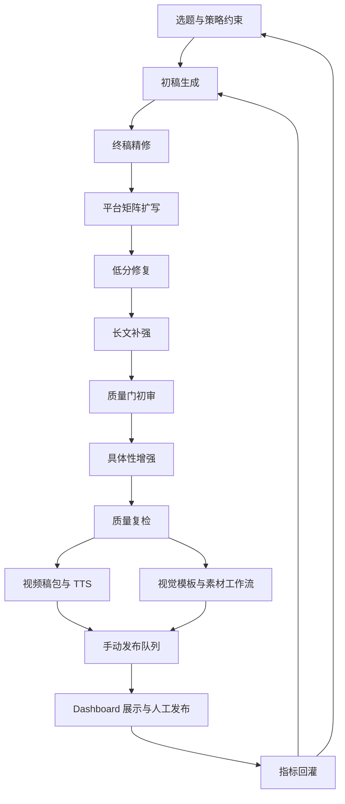

# OpenClaw 内容系统总手册

最后更新：`2026-03-09`
维护状态：当前有效
文档定位：本文件是当前仓库的单一真源（single source of truth）。后续每次任务完成后，都必须先更新本文件，再结束交付。
适用对象：接手开发者、日常运营者、故障排查人员。

## 1. 系统定位

### 1.1 目标

这套系统的目标不是“全自动乱发”，而是建立一条可控的内容生产链：

1. 自动生成多平台内容包。
2. 自动完成质量审查、补强、平台扩写、素材策略、视频稿包和手动发布队列。
3. 通过 Dashboard 统一浏览内容、回填发布状态、上传平台数据、查看 Agent 健康状态。
4. 用真实平台数据驱动下一轮自动优化，而不是长期靠手改 prompt。

### 1.2 当前生产模式

1. 生产自动化。
2. 审稿半自动化。
3. 发布人工执行。
4. 数据回灌自动分析。

### 1.3 明确不在当前生产模式内的事情

1. 自动养号。
2. 自动绕过验证码。
3. 未经人工确认的全自动外发。
4. 自动抓取并直接复用第三方受版权限制图片。

### 1.4 当前上线判断

当前系统已经适合进入“人工审稿 + 人工发布 + 自动复盘”的生产阶段。

原因：

1. 图文链路已稳定过质量门。
2. 发布队列、图片策略、数据回灌、监控面板都已打通。
3. 风险最大的环节仍然是平台外发和视频真实感，因此保留人工发布是合理边界。

## 2. 当前系统状态

截至本次更新，系统当前具备：

1. `8` 平台内容矩阵生产：知乎、小红书、微博、公众号、头条、抖音、西瓜视频、B站。
2. 长文补强、低分修复、具体性增强、质量复检全链路。
3. 视频稿包、TTS 输出、封面策略输出。
4. 消费类/好物类题材的“真实图优先”策略。
5. 非消费类题材的 ComfyUI 出图链路。
6. Dashboard 局域网访问、开机自启、内容浏览、复制、发布状态回填、数据回灌、Agent 监控。
7. 自动化根据 `metrics_analysis_latest.json` 调整下一轮标题、Hook、CTA、结构密度。

当前已知仍需持续优化：

1. 视频 TTS 仍偏机器人音，特别是西瓜视频和抖音口播。
2. 视频封面和镜头素材真实感仍不足，消费类视频更明显。
3. 研究资料过滤还需要持续收敛，避免出现“来源有，但价值不高”的上下文。
4. 当前真实图片工作流仍是“人工搜图 + 系统给清单”，还不是全自动素材库。
5. 自动调优目前主要基于规则和指标映射，还没有做到更强的多轮策略学习。

## 3. 仓库与环境

### 3.1 本地开发目录

- 仓库根目录：`C:\Users\Roy\Documents\New project`
- 模板目录：`C:\Users\Roy\Documents\New project\templates`
- 静态资源：`C:\Users\Roy\Documents\New project\static`
- 报告目录：`C:\Users\Roy\Documents\New project\reports`
- 主文档：`C:\Users\Roy\Documents\New project\SYSTEM_REFERENCE.md`

### 3.2 远端生产目录

- 远端工作区：`C:\Users\Roy\.openclaw\workspace`
- 远端内容产物：`C:\Users\Roy\.openclaw\workspace-content`
- ComfyUI：`C:\Users\Roy\ComfyUI`
- ComfyUI 输出：`C:\Users\Roy\ComfyUI\output`

### 3.3 远端连接

- Host：`192.168.3.120`
- Port：`2222`
- User：`Roy`

敏感信息不要写死到正文。Dashboard 访问口令以这个文件为准：

- `C:\Users\Roy\Documents\New project\reports\dashboard_access_latest.txt`

## 4. 依赖清单

### 4.1 Python

本地和远端至少需要：

- `flask`
- `paramiko`
- `requests`
- `waitress`
- `jinja2`
- `moviepy`
- `pillow`
- `numpy`

推荐版本策略：

1. 远端生产统一用 `Python 3.12`。
2. 本地调试也优先使用 `py -3.12`。
3. 不要默认用 `py -3`，本机可能会落到 `Python 3.14 alpha`。

### 4.2 Node / CLI

- `Node.js`
- `OpenClaw` CLI
- 默认 CLI 路径：`%APPDATA%\npm\openclaw.cmd`

### 4.3 Windows / 系统依赖

- `System.Speech`：本地 TTS 渲染。
- Windows 任务计划程序：开机自启。
- Windows 防火墙入站规则：Dashboard 局域网访问。
- `ssh` / OpenSSH：本地到远端部署和调试。

### 4.4 ComfyUI / 视觉依赖

- ComfyUI
- DirectML 可用环境
- 当前已验证或已接入的关键模型资产：
  - `flux1-schnell.safetensors`
  - `clip_l.safetensors`
  - `text_encoder_2`
  - `ae.safetensors`
  - `Juggernaut-XL_v9_RunDiffusionPhoto_v2.safetensors`
- 用户已额外准备的模型资产：
  - `FLUX.2-klein-9b-fp8`
  - `qwen-image-2512-Q4_K_M.gguf`
  - `Wan2.2-TI2V-5B-Q8_0.gguf`
  - `z-image-turbo-F16.gguf`

### 4.5 搜索 / 研究依赖

推荐研究源：

1. 本地 SearXNG：`http://127.0.0.1:8080`
2. 可选搜索包装器：`searxng_search`、`search`

说明：

1. 研究源不是硬依赖。
2. 没有研究源时系统仍能跑，但长文更容易变空、证据密度会下降。
3. 后续应优先把“热点检索 + 平台资料检索”稳定接到本地搜索引擎，而不是依赖杂乱网页源。

### 4.6 可选外部系统

- AdsPower Local API：当前保留，不参与本轮生产发布链。
- 地址示例：`http://local.adspower.net:50361`

## 5. Agent 架构

系统内部有两层 Agent：

1. OpenClaw 逻辑 Agent。
2. Python 执行链路脚本。

### 5.1 OpenClaw 逻辑 Agent

| Agent | 职责 | 当前用途 |
| --- | --- | --- |
| `main` | 总控摘要 | 健康检查与系统摘要 |
| `main-brain` | 生产策略中枢 | 选题、平台目标、变现路径、规则约束 |
| `content` | 文案生产 | 首稿生成、重写、平台扩写 |
| `multimodal` | 视觉提示生成 | 封面 prompt、negative prompt、素材策略 |
| `publisher` | 发布动作规划 | 当前仅输出前置条件和发布提醒，不直接自动发布 |
| `monitor` | 监控与指标解释 | Agent 健康、任务摘要、指标解释 |
| `tasks` | 任务编排 | 输出待办、任务状态和调度摘要 |

### 5.2 Python 执行器

| 模块 | 角色 | 关键输入 | 关键输出 |
| --- | --- | --- | --- |
| `autopipeline_brain_content_publisher.py` | 主生产调度器 | 选题、历史指标 | 全流程产物 |
| `content_autotune_runner.py` | 初稿生成和迭代 | topic、research、metrics | 首稿/修订稿 |
| `final_publish_refiner.py` | 终稿精修 | 草稿包 | 精修稿、补充结构 |
| `matrix_pack_expander.py` | 平台矩阵扩写 | 精修稿 | 全平台 drafts |
| `low_score_repair_runner.py` | 低分修复 | drafts、质量报告 | repaired pack |
| `longform_guard_runner.py` | 长文补强 | 长图文 draft | 长文强化版 |
| `content_quality_gate.py` | 质量门 | pack | quality JSON |
| `specificity_boost_runner.py` | 具体性增强 | pack | boosted pack |
| `video_publish_pack_builder.py` | 视频稿包生成 | 视频 draft | shot list / tts script |
| `tts_render_windows.py` | TTS 渲染 | video kit | 音频文件 |
| `platform_visual_templates.py` | 视觉/素材策略 | topic、platform | visual_templates |
| `generate_pack_assets.py` | 封面资产生成或跳过 | assets + visual_templates | asset manifest |
| `manual_publish_queue_builder.py` | 手动发布队列 | pack/quality/assets/tts | queue JSON / MD |
| `daily_metrics_ingest.py` | 数据回灌分析 | 上传的 CSV / JSON | metrics analysis |
| `dashboard_service.py` | 远端读写和桥接 | SSH、远端文件 | snapshot / media / metrics ingest |
| `dashboard_app.py` | Web 控制台 | service layer | 页面和操作入口 |
| `full_agent_healthcheck.py` | Agent 可用性测试 | OpenClaw 环境 | health report |

### 5.3 Agent 间协作逻辑

1. `main-brain` 定义这一轮该做什么内容、面向谁、靠什么变现。
2. `content` 先产出草稿，再由修复器和长文守卫持续补强。
3. `multimodal` 决定是出 AI 图还是给人工真实图清单。
4. `monitor` 和 `tasks` 负责把运行结果压回 Dashboard 和报告文件。
5. 指标回灌后，下一轮仍从 `main-brain` 和 `content` 两层同时吃反馈。

## 6. 数据契约与产物

### 6.1 主要产物路径

| 产物 | 路径模式 | 用途 |
| --- | --- | --- |
| 管线报告 | `workspace\reports\pipeline_autorun_{stamp}.json` | 看每一步是否成功 |
| Agent 健康报告 | `workspace\reports\agent_health_full_{stamp}.json` | 看 OpenClaw 各 Agent 可用性 |
| 内容包 | `workspace-content\daily_pack_{stamp}.json` | 核心内容产物 |
| 初审质量报告 | `workspace-content\quality_{stamp}.json` | 第一轮质量门 |
| 复检质量报告 | `workspace-content\quality_{stamp}_recheck.json` | 最终是否可发 |
| TTS 目录 | `workspace-content\tts_{stamp}` | 视频音频输出 |
| 资产清单 | `workspace-content\asset_manifest_daily_{stamp}.json` | 封面状态、素材策略、来源优先级 |
| 发布队列 JSON | `workspace-content\manual_publish_queue_{stamp}.json` | 网站和脚本读取 |
| 发布队列 MD | `workspace-content\manual_publish_queue_{stamp}.md` | 人工快速查看 |
| 指标分析 JSON | `workspace-content\metrics_analysis_{stamp}.json` | 下一轮自动调优输入 |
| 最新指标分析 | `workspace-content\metrics_analysis_latest.json` | 主脑和内容生成器读取 |

### 6.2 当前关键字段

#### `daily_pack_*.json`

关键字段：

- `topic`
- `drafts[]`
- `assets[]`
- `visual_templates`
- `video_publish_kits`

#### `quality_*.json`

关键字段：

- `results[]`
- `total_score`
- `pass_gate`
- `issues[]`

#### `asset_manifest_*.json`

关键字段：

- `cover_strategy`
- `material_workflow`
- `reference_search_queries`
- `cover_layout_brief`
- `source_priority`
- `manual_asset_checklist`
- `material_slots`
- `output_file`
- `engine`

#### `manual_publish_queue_*.json`

关键字段：

- `platform`
- `title`
- `body`
- `hook`
- `cta`
- `score`
- `pass`
- `cover_strategy`
- `material_workflow`
- `cover_layout_brief`
- `source_priority`
- `material_slots`
- `manual_asset_checklist`
- `reference_search_queries`
- `tts_file`

## 7. 运行链路



### 7.1 主入口

- [autopipeline_brain_content_publisher.py](C:\Users\Roy\Documents\New%20project\autopipeline_brain_content_publisher.py)

默认职责：

1. 选题。
2. 主脑策略。
3. 初稿生成。
4. 终稿精修。
5. 平台扩写。
6. 修复与长文补强。
7. 质量门与复检。
8. TTS。
9. 封面策略和可选出图。
10. 手动发布队列。

### 7.2 一轮生产的实际执行顺序

1. 根据 topic、历史指标和平台基线决定本轮内容方向。
2. 生成初稿并读取 research context。
3. 按平台扩写为全矩阵内容。
4. 低分稿走修复器，长文走长文守卫。
5. 走质量门，失败项继续修。
6. 对通过项构建视频稿包、TTS 和视觉模板。
7. 如果题材允许，走 ComfyUI 出图；如果是消费决策题材，则只输出真实图片工作流。
8. 生成手动发布队列。
9. 人工从 Dashboard 审稿并发布。
10. 导出平台数据回灌，系统自动生成下一轮优化信号。

## 8. 平台生产与变现基线

下表是当前代码和运营策略里的生产基线，不是平台官方规则。

| 平台 | 主内容形态 | 建议日产出 | 建议日发布 | 发布时间窗 | 当前主要变现路径 |
| --- | --- | --- | --- | --- | --- |
| 知乎 | 长回答 / 长文 | 2 | 1 | `12:00-13:30`, `20:00-22:00` | 好物卡、资料包、咨询线索 |
| 小红书 | 图文笔记 | 3 | 2 | `11:30-13:00`, `19:00-22:30` | 店铺转化、数字产品、私信线索 |
| 微博 | 快评 / 单条观点 | 3 | 2 | `10:00-12:00`, `18:00-21:00` | 单链路导流、热点合作 |
| 公众号 | 深度文章 | 1 | 1 | `08:00-09:30`, `20:00-22:00` | 流量主、资料包、私域承接 |
| 头条 | 长图文 | 3 | 2 | `09:00-11:00`, `18:00-20:30` | 图文收益、商品卡、专栏 |
| 抖音 | 短视频口播 | 3 | 2 | `12:00-13:30`, `19:00-22:30` | 橱窗、资料引流、后续直播 |
| 西瓜视频 | 横屏母体视频 | 1 | 1 | `12:00-14:00`, `19:30-22:00` | 中长视频收益、系列导流 |
| B站 | 评测 / 流程视频 | 1 | 1 | `18:30-21:30` | 悬赏带货、花火、资料包 |

### 8.1 知乎

1. 重点是高信任，而不是纯情绪。
2. 正文必须有“适合谁 / 不适合谁 / 步骤 / 案例 / 对照表”。
3. 优先承接好物卡、选购单、资料包。
4. 当前不足：有些稿子仍可能“结构完整但案例不够硬”。

### 8.2 小红书

1. 重点是保存率和点开率。
2. 图比字重要，首图远比正文更决定是否能起量。
3. 好物题材优先真实图，不建议默认 AI 封面。
4. 当前不足：如果图不够真实，整篇笔记会直接掉信任。

### 8.3 微博

1. 结构必须短：一个判断、一个证据、一个动作。
2. 不要一条里放多个跳转动作。
3. 适合热点借势、引流到更长承接位。
4. 当前不足：如果话题选得太窄，天然流量天花板低。

### 8.4 公众号

1. 重点是留存和后续承接。
2. 不能只有观点，必须有执行路径。
3. 适合作为最稳的深度内容承接位。
4. 当前不足：开头如果不够快，容易掉打开后的阅读完成率。

### 8.5 头条

1. 重点是长文耐读性和前段点击回报。
2. 前三段一定先给结论，不要铺垫太久。
3. 适合做场景避坑、误区拆解、信息聚合。
4. 当前不足：如果题材太窄或资料感不强，收益上限一般。

### 8.6 抖音

1. 首屏必须快。
2. CTA 只保留一个动作。
3. 当前文案和视频稿包链路已通。
4. 当前不足：TTS 还不够像真人，封面真实感不足。

### 8.7 西瓜视频

1. 优先横屏母体视频。
2. 信息密度要完整，不能照搬短视频节奏。
3. 适合做更完整的避坑和测评讲解。
4. 当前不足：TTS 和封面真实感仍然明显拖后腿。

### 8.8 B站

1. 重点是可信度和观看时长。
2. 不适合高频堆量。
3. 要求中段有证据、对比或测试上下文。
4. 当前不足：如果只是 AI 风视频包装，用户很快会判断为低质量搬运。

## 9. 图片与视频素材策略

### 9.1 总规则

当前封面策略只分两类：

1. `real_reference_preferred`
2. `comfy_generated_ok`

### 9.2 必须优先真实图的题材

| 题材桶 | 原因 |
| --- | --- |
| 家清 / 家电 / 智能家居 | 用户非常看重外观、尺寸、刷头、结构和场景感 |
| 数码装备 | 接口、工业设计、屏幕与边框比例必须正确 |
| 宠物用品 | AI 容易把毛发、眼睛、四肢做坏 |
| 珠宝配饰 | 材质、佩戴效果、光泽很难靠 AI 保真 |
| 运动装备 | 人体结构和上身效果必须真实 |

### 9.3 可以用 ComfyUI 的题材

1. AI 工具。
2. 效率工作流。
3. 方法论。
4. 概念型选题。
5. 情绪 / 氛围表达类题材。

### 9.4 真实图片素材工作流

本轮新增的真实图片工作流不是“自动抓图”，而是“系统给出明确素材规范，人工选最稳的图”。

当前每条内容会输出：

1. `material_workflow`：当前该走人工真实图还是 ComfyUI。
2. `cover_layout_brief`：封面布局建议。
3. `source_priority`：素材来源优先级。
4. `material_slots`：图位清单，每个图位有用途、画面要求、搜图词。
5. `manual_asset_checklist`：选图时的检查清单。
6. `reference_search_queries`：通用搜图词。

这样做的原因：

1. 好物类内容最怕“图假”。
2. 自动抓图会引入版权和质量双重风险。
3. 人工选图仍然是最稳的质量控制点。

### 9.5 ComfyUI 当前使用原则

1. 24G 内存机器上，优先 `--skip-assets` 跑文案回归。
2. 只有在题材允许 AI 图时再拉起 ComfyUI。
3. 9060 XT 上优先尝试 FLUX Schnell 路径，消费类题材不要强行用 AI 封面顶替真实图。
4. 跑完后及时释放浏览器、AdsPower 和无关进程，避免内存被吃满。

## 10. Dashboard 与运维

### 10.1 页面

- `/`：总览
- `/content`：发布台
- `/metrics`：数据回灌
- `/monitor`：系统监控

### 10.2 当前能力

1. 浏览最新和历史内容包。
2. 查看正文、Hook、CTA、标签、视频稿包。
3. 复制标题、正文、整稿、搜图词、素材清单。
4. 查看图片策略、图位建议、来源优先级和素材检查清单。
5. 回填发布状态。
6. 上传平台数据并触发自动分析。

### 10.3 开机自启与局域网访问

关键文件：

- [dashboard_app.py](C:\Users\Roy\Documents\New%20project\dashboard_app.py)
- [dashboard_service.py](C:\Users\Roy\Documents\New%20project\dashboard_service.py)
- [deploy_remote_dashboard.py](C:\Users\Roy\Documents\New%20project\deploy_remote_dashboard.py)

远端任务计划：

1. `OpenClawDashboardServer`
2. `OpenClawDailyPipeline`

当前 Dashboard 默认地址：

- [http://192.168.3.120:8787](http://192.168.3.120:8787)

### 10.4 常见运维动作

1. 部署模板或脚本后，如果网页没变化，先确认远端文件真的同步。
2. 再看远端 `waitress` 或 `python` 进程启动时间是否更新。
3. 必要时重启 `OpenClawDashboardServer`。

## 11. 数据回灌与自动调优

### 11.1 回灌入口

网站入口：

- `/metrics`

主要模块：

- [metrics_adapter.py](C:\Users\Roy\Documents\New%20project\metrics_adapter.py)
- [daily_metrics_ingest.py](C:\Users\Roy\Documents\New%20project\daily_metrics_ingest.py)

### 11.2 数据流

1. 平台导出 CSV 或 JSON。
2. `metrics_adapter.py` 统一转成标准字段。
3. `daily_metrics_ingest.py` 输出 `metrics_analysis_{stamp}.json` 和 `metrics_analysis_latest.json`。
4. 下一轮生产时，主脑和内容生成器自动读取最新分析结果。

### 11.3 当前会自动调的内容

1. 标题强度。
2. Hook 是否更快给结论。
3. CTA 是否收敛到单动作。
4. 是否增加证据、对照、来源感。
5. 长文是否加强“结论 - 误区 - 步骤 - 适合谁”的结构。
6. 哪些平台更偏收藏型、哪些更偏点击型。

### 11.4 当前统一指标字段

- `impressions`
- `views`
- `likes`
- `comments`
- `favorites`
- `shares`
- `follows`
- `profile_clicks`
- `product_clicks`
- `revenue`
- `avg_watch_sec`
- `read_complete_rate`

### 11.5 仍需加强的自动调优能力

1. 目前还没有真正按平台做更强的 A/B 赛马自动淘汰。
2. 目前还没有自动回写到更细粒度的 topic bucket 权重。
3. 目前还没有把发布时间优化做成强闭环。
4. 后续应引入“平台-题材-标题结构”的多维胜率统计。

## 12. 常用命令

### 12.1 跑完整生产链

```powershell
py -3.12 C:\Users\Roy\.openclaw\workspace\autopipeline_brain_content_publisher.py --skip-publisher
```

### 12.2 跳过封面，快速回归

```powershell
py -3.12 C:\Users\Roy\.openclaw\workspace\autopipeline_brain_content_publisher.py --skip-publisher --skip-assets
```

### 12.3 只重建质量复检

```powershell
py -3.12 C:\Users\Roy\.openclaw\workspace\content_quality_gate.py --input C:\Users\Roy\.openclaw\workspace-content\daily_pack_{stamp}.json --output C:\Users\Roy\.openclaw\workspace-content\quality_{stamp}_recheck.json --min-score 85
```

### 12.4 只重建手动发布队列

```powershell
py -3.12 C:\Users\Roy\.openclaw\workspace\manual_publish_queue_builder.py --input-pack C:\Users\Roy\.openclaw\workspace-content\daily_pack_{stamp}.json --input-quality C:\Users\Roy\.openclaw\workspace-content\quality_{stamp}_recheck.json --input-assets C:\Users\Roy\.openclaw\workspace-content\asset_manifest_daily_{stamp}.json --tts-dir C:\Users\Roy\.openclaw\workspace-content\tts_{stamp} --output-json C:\Users\Roy\.openclaw\workspace-content\manual_publish_queue_{stamp}.json --output-md C:\Users\Roy\.openclaw\workspace-content\manual_publish_queue_{stamp}.md --latest-json C:\Users\Roy\.openclaw\workspace-content\manual_publish_queue_latest.json --latest-md C:\Users\Roy\.openclaw\workspace-content\manual_publish_queue_latest.md --generated-at {stamp}
```

### 12.5 重启远端 Dashboard

1. 运行 `deploy_remote_dashboard.py`。
2. 如果模板未生效，检查远端进程启动时间。
3. 必要时重启 `OpenClawDashboardServer` 或直接重启对应 Python 进程。

## 13. 故障排查

### 13.1 图文质量看起来过线，但仍不适合发布

先看：

- 选题是否足够大盘。
- 标题是否过窄。
- 资料源是否只是“有来源”但没有真正有价值的信息。
- 封面是否在消费类题材上仍用了不可信的 AI 图。

### 13.2 知乎或长文被误判为收益承诺

查看：

- [content_quality_gate.py](C:\Users\Roy\Documents\New%20project\content_quality_gate.py)

当前规则已经修过：

1. 商品价格不会再被误判为收益承诺。
2. 只有 `月入 / 月赚 / 多赚 / 变现 / 盈利` 一类上下文才会触发。
3. `不承诺收益` 这类否定表述不会误杀。

### 13.3 页面模板已改但网站没生效

排查顺序：

1. 远端文件是否真的同步。
2. 远端 `waitress` / `python` 进程是否还是旧启动时间。
3. 是否需要重启 `OpenClawDashboardServer`。

### 13.4 ComfyUI 起不来

优先看：

- [start_comfy_directml.py](C:\Users\Roy\Documents\New%20project\start_comfy_directml.py)

排查顺序：

1. `http://127.0.0.1:8188/object_info` 是否可访问。
2. DirectML 环境与模型是否到位。
3. 是否有浏览器、AdsPower 或其他进程占满内存。

### 13.5 视频稿能生成，但不值得发

高概率原因：

1. TTS 太机器人。
2. 封面不够真实。
3. 镜头计划太像模板化拼装，没有真实证据。

优先修改：

1. `tts_render_windows.py`
2. `video_publish_pack_builder.py`
3. `platform_visual_templates.py`
4. `generate_pack_assets.py`

## 14. 已知不足与后续改进路线

### 14.1 当前不足

1. 视频音色仍明显不如真人口播。
2. 真实图片工作流还没有接“素材库管理”和“历史素材复用”。
3. 热点和资料抓取还没有完全切到本地搜索引擎优先。
4. 自动调优仍偏规则驱动，不是更完整的实验驱动。
5. 平台级变现策略虽然已内化到生产策略里，但还缺更明确的收益归因模型。

### 14.2 下一阶段优先事项

1. 接入本地搜索引擎作为热点与资料主入口。
2. 继续升级真实图片工作流：素材库、图位模板、历史素材复用。
3. 升级视频链路：更好 TTS、真实截帧优先、镜头证据强化。
4. 做更细的自动化数据复盘：题材、标题、平台、发布时间联合分析。
5. 补充一个“运营日报/周报生成器”，自动给出下周内容建议。

### 14.3 还没做完的高价值项

这部分是已经明确值得做、但本轮还没有继续开发的内容。

1. 本地搜索引擎主链化。
   当前系统已经有搜索依赖和研究入口，但还没有把“热点检索 + 指定平台资料检索”稳定切到本地搜索引擎优先。这个改完后，选题质量、长文资料质量和热点响应速度都会更稳。
2. 视频链路升级。
   当前视频脚本、镜头计划和 TTS 输出已经能跑，但西瓜视频、抖音、B站的真实感仍然不够，尤其是 TTS 音色和封面真实感，直接影响是否值得发。
3. 真实图片素材库复用。
   当前真实图片工作流已经能给出图位建议、来源优先级和搜图词，但还没有做素材库存档、历史素材复用、按题材复用图位模板，这会影响长期效率。
4. 自动调优升级为更强实验闭环。
   当前自动调优仍以规则和指标映射为主，缺少更明确的平台-题材-标题结构胜率统计，以及更自动化的 A/B 赛马淘汰机制。
5. 变现归因增强。
   当前系统已经内化平台变现方向，但还没有把“内容结构 -> 数据表现 -> 收益结果”的因果链压得足够清晰，后续要补收益归因和平台级 ROI 视图。

### 14.4 建议直接做的内容

如果后续恢复开发，建议按下面顺序直接推进，不要散着做。

1. 本地搜索引擎接入主生产链。
   目标：让热点抓取、资料收集、指定平台研究都优先走本地搜索引擎，而不是零散网页源。
   产出：稳定 research context、可控来源白名单、按平台/题材的资料过滤。
2. 视频链路升级。
   目标：把西瓜视频、抖音、B站做成“能发”的版本，而不是“能跑”的版本。
   产出：更像真人的 TTS、真实截帧优先策略、消费类视频封面真实化、镜头中段证据强化。
3. 自动调优闭环增强。
   目标：让系统基于每天/每周平台数据自动压实题材、标题、发布时间和 CTA 的优化，而不是停留在较粗的规则调节。
   产出：更细的多维胜率统计、发布时间建议、平台差异化复盘。

### 14.5 不建议现在做的事

1. 在视频真实感没解决前强推全自动视频量产。
2. 在素材合规没定清楚前做全自动抓图。
3. 在平台侧未验证前做无人值守自动发布。

## 15. 接手开发者工作指南

### 15.1 开始修改前先看

1. 本文件：`SYSTEM_REFERENCE.md`
2. 最近一批管线报告
3. 最近一批质量复检报告
4. 最近一批发布队列
5. 最新 `metrics_analysis_latest.json`

### 15.2 常见修改入口

| 目标 | 优先修改文件 |
| --- | --- |
| 改选题 | `autopipeline_brain_content_publisher.py`, `news_guard.py` |
| 改文案生成 | `content_autotune_runner.py`, `final_publish_refiner.py` |
| 改质量门 | `content_quality_gate.py` |
| 改长文深度 | `longform_guard_runner.py`, `low_score_repair_runner.py` |
| 改平台扩写 | `matrix_pack_expander.py` |
| 改素材策略 | `platform_visual_templates.py`, `generate_pack_assets.py` |
| 改视频链路 | `video_publish_pack_builder.py`, `tts_render_windows.py` |
| 改 Dashboard | `dashboard_app.py`, `dashboard_service.py`, `templates\content_board.html` |
| 改指标回灌 | `metrics_adapter.py`, `daily_metrics_ingest.py` |

### 15.3 每次任务结束必须做的事

1. 更新 `SYSTEM_REFERENCE.md`。
2. 写清这次改了什么、没改什么、剩余风险是什么。
3. 如果变更影响页面或远端行为，至少做一次本地验证或远端验证。
4. 如果动了生产策略，补一条到“已知不足与后续改进路线”。

## 16. 本次更新记录

本次主要新增或确认：

1. 主手册升级为可交接版本，覆盖架构、链路、依赖、运维、数据契约、平台说明、已知不足和后续路线。
2. 新增真实图片素材工作流字段：`material_workflow`、`cover_layout_brief`、`source_priority`、`material_slots`、`manual_asset_checklist`。
3. 发布队列与 Dashboard 已开始消费上述字段。
4. 后续每次开发交付前，都必须先更新本文件。
5. 已把“还没做完的高价值项”和“建议直接做的内容”固定进路线图，便于后续接手开发。
